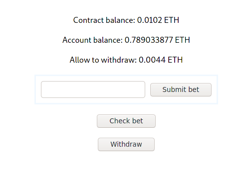
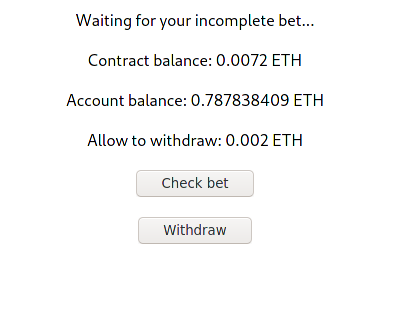

# Ivan on Tech Academy

__Oracle Solidity example using Provaple as a random source provider and React for front-end__

----

- Deploy to the Ropsten network:

*truffle migrate --network ropsten*

- Create sym link to **build** directory:

*ln -s build frontend/src/build*

- Run development webpack local server:  

*cd frontend && yarn start*

----

